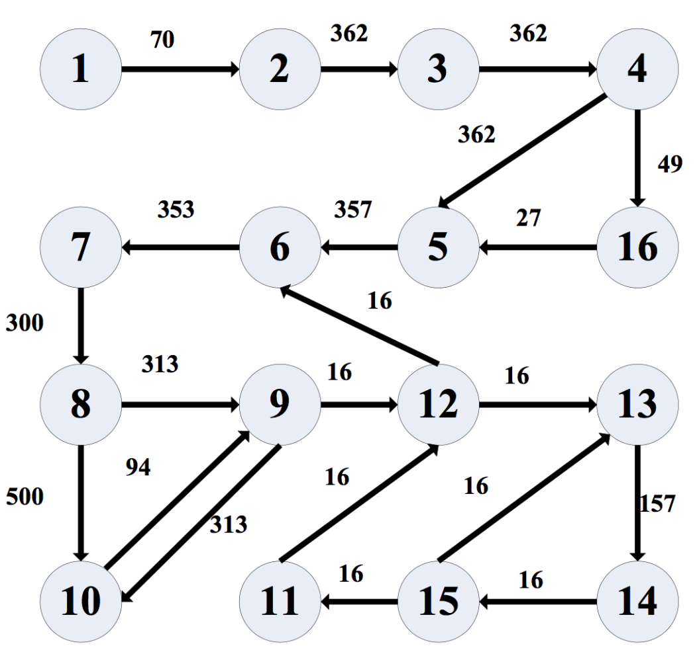
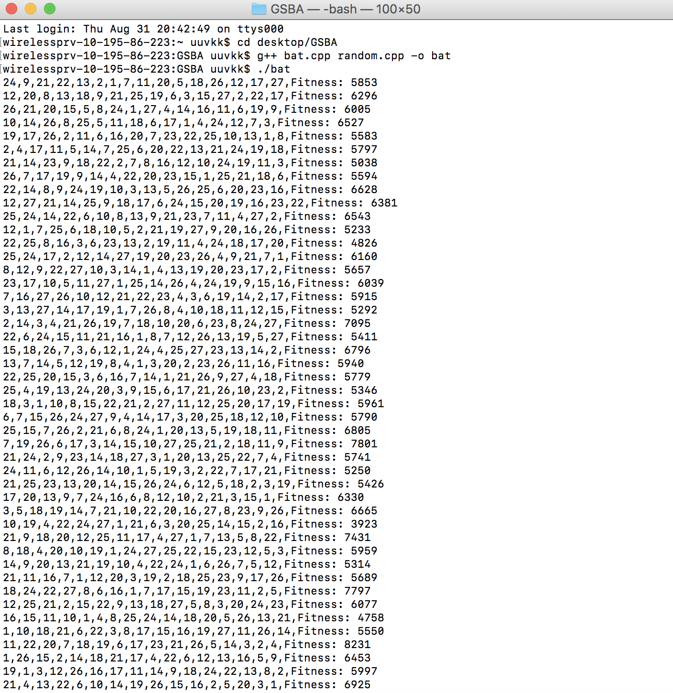
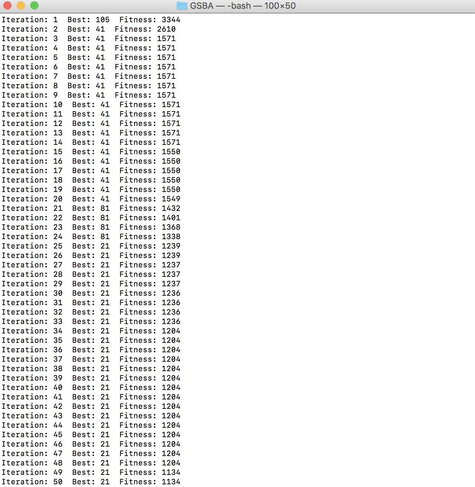
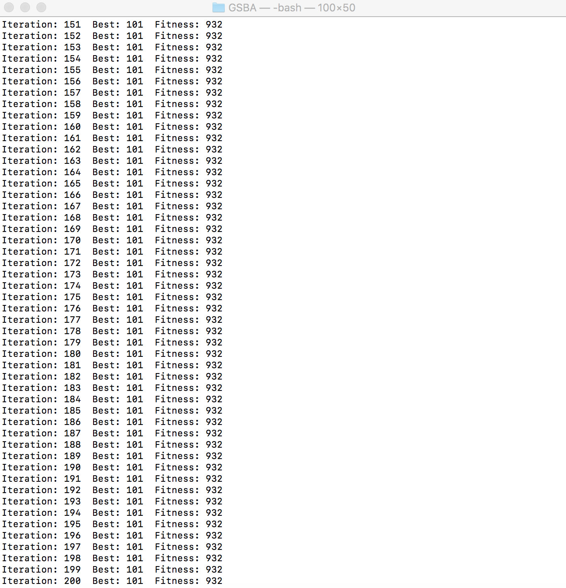

# Bat-Algorithm-for-3D-Network-on-Chips-Mapping
This project is to solve what we call mapping problems for 3D Network-on-Chips (NoC), finished by me using C++ on Linux Platform, and it can also perfectly run on Mac OS (I am not sure whether it does on Windows). NoC is a novel architecture to design multi-processor chips, where the concept of network is introduced in System-on-Chips (SoC). Mapping is to distribute a task graph as an assignment of Intellectual Properties (IP) onto the topology structure of a NoC, trying to optimize one or more performance metrics of power consumption, execution time, delay and load balance. My target was to minimize the power cost, thus the mapping problem became a single-object optimization problem, which can be solved effectively by intelligence optimization algorithms, like genetic algorithm, simulated annealing algorithm and particle swarm algorithm. I firstly used a novel meta-heuristic algorithm called Bat Algorithm (BA) proposed in 2012 to solve mapping problem.

What I did in this project were firstly building a 3D NoC platform, which we assume is a homogeneous chip, secondly making an approximate power model, also used as the fitness function in my iterations, and finally using BA to do the optimization iterations. The example graph here I used was Video Object Plane Decoder (VOPD), as shown in the following Fig.

I mapped this graph with 16 nodes and 21 edges onto a 3*3*3 mesh structured NoC, aiming to find the arrangement of IP cores with the lowest power consumption. The method was generating populations with a certain number of individuals randomly, where each individual represents one arrangement of the nodes on the NoC. The next Fig shows the generations of random individuals, with their initial fitness values.

Then as the iterations proceed, the algorithm can find better solutions with lower fitness values, and also output which one the current best is, and its fitness value. In the bat.h file we can set the population scale and the maximum iteration times. I have to mention that random.cpp and random.h were cited from others' work, but excellently applied in my project. The iteration process is shown in the following Figs.

